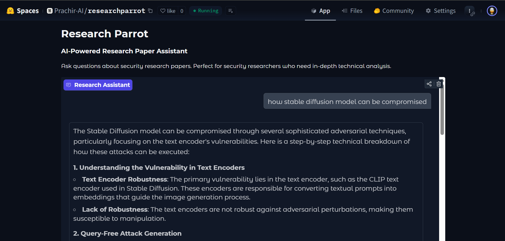

# Research Parrot

An AI-powered research paper assistant for security researchers. Ask questions about security research papers and get in-depth technical analysis.

🔗 **Live Demo:** [Research Parrot](https://huggingface.co/spaces/Prachir-AI/researchparrot)

## Features

- **RAG-based Q&A**: Query your research papers using semantic search powered by Pinecone
- **Security-focused**: Tailored responses for security researchers with technical depth
- **LaTeX Support**: Properly renders mathematical formulas and equations
- **HuggingFace Inference**: Uses open-source LLMs via HuggingFace Inference API

## Tech Stack

- [Gradio](https://gradio.app) - Web interface
- [HuggingFace Hub](https://huggingface.co/docs/huggingface_hub) - LLM inference
- [LangChain](https://langchain.com) - RAG framework
- [Pinecone](https://pinecone.io) - Vector database

## Configuration

Set these secrets in your Hugging Face Space settings:

| Secret | Description |
|--------|-------------|
| `HF_TOKEN` | Your Hugging Face API token |
| `PINECONE_API_KEY` | Your Pinecone API key |

## Usage

Simply type your question about security research topics like:
- "What is prompt injection?"
- "Tell me about jailbreaking techniques"
- "Explain RAG architecture"
- "What are the main attack vectors discussed?"
